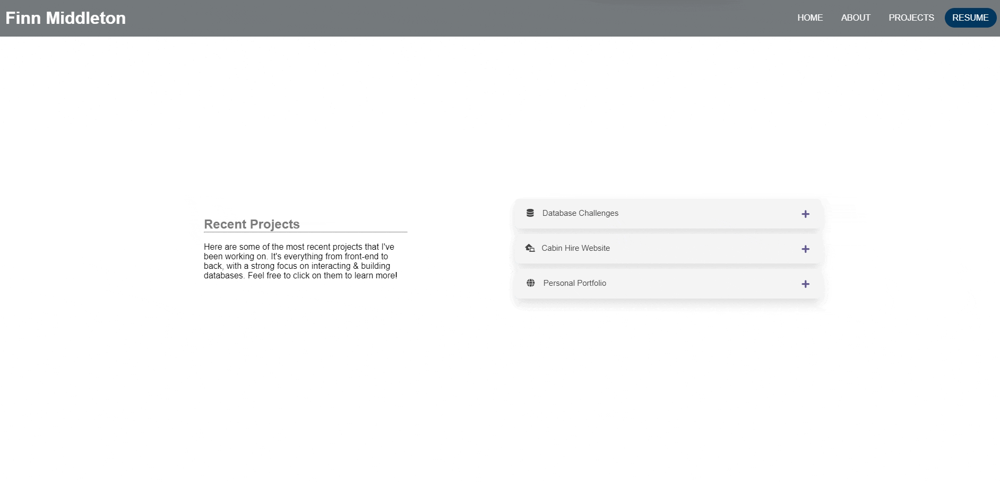

# My Web Development Portfolio

Hi! Welcome to my personal web development portfolio! This website is a reflection of my journey in the world of web-programming. It showcases my skills, projects, and passion for creating impactful and useful web tools.

## Table of Contents

- [About](#about)
- [Skills](#skills)
- [Site](#site)

## About

Hi! My names Finn, I'm an entry-level web developer with a strong interest in learning about databases. Passionate about creating engaging and user -friendly web experiences, with a foundation in both front-end and back-end development.

As I continue to grow in the ever-evolving field of web development, feel free to take a look at my portfolio to see what I'm working on and the ongoing journey I'm taking to learning what I can!

## Skills

I offer a diverse set of skills that contribute to being a web developer, ensuring effectiveness across the board. From front-end technologies like HTML, CSS, and JavaScript to back-end proficiency with PHP and database management.

My comprehensive skill set enables me to adeptly navigate various facets of web development, delivering robust and well-integrated solutions. Strengthened by a quick ability to pick up and learn whatever new skills may be required.

## Site

Have a quick peek though my showcased portfolio to witness the practical application of my skills. Or alternatively, visit the live location right now.

[Visit My Portfolio](https://www.finnmiddleton.com)

---

Thanks for visiting my portfolio and exploring my web development journey. Let me know if you have any feedback or contributions!
